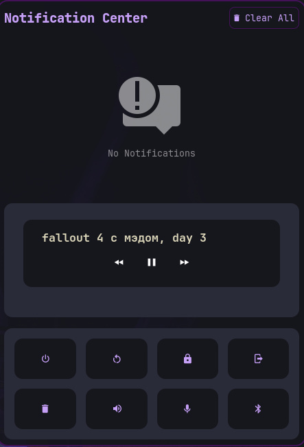
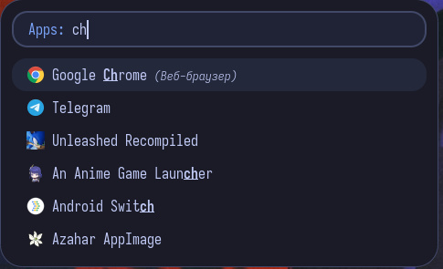

# Sway Dotfiles

Dotfiles for regular Sway. The idea was that I'd try to do as much as possible with "as little as possible" in terms of packages/scripts, so I can just drop this on a new laptop and go.

It really isn't fancy or flashy by any means. Kinda designed it all for a specific wallpaper, but who knows, maybe you'll like it. Don't open the `style.css` files unless you really have to because it is a mess and I'm ashamed.

Sway config is included but that's mainly for me. There's some stuff for swaylock and all that.

---

### Included Configs

<b>Waybar</b> (Click to expand)

 

The colors are kinda odd for modules but I was so tired I couldn't be bothered to fix them. Should be pretty easy to find the lines for them in `style.css`. Stole the template from somebody else and redesigned it a little bit to fit a specific wallpaper that I like.

It has the following modules on the left: Power menu, Workspaces, Idle_inhibitor, privacydots(expands towards the cetner), sway/mode (towards center as well) both modules expand the left "pill" without animations.

On the right it has: Tray, Notifications, Clipboard (you'll need the usual cliphist...etc), Language, Brightness, CPU, Memory, Temperature (cpu and memory expand towards the center from here), Bluetooth, Pulseaudio, Clock. 

**Known issues / To-do:**
* **Workspaces:** Inactive workspaces that have that "indented" look need further styling.
* **Spacings:** Gaps between tray and notifications need to be unified. Same goes for the module group that unfolds towards the center.
* **Consistency:** Colors need a unified language, especially for different "states."
* **No Prompts:** Everything just "happens." If you press Reboot, it immediately does so.
* **Active workspace button:** It has a faint white border top left+right corners. Couldn't get it out.
* **Tray:** It looks ugly. I don't know if you can do anything about it though. Also it disappears if you reload the config a couple of times.
* **Tooltips and hovers:** Didn't do much with them. They can also mess with how colors look when you mouse-over stuff in your bar.
* **Background:** The bar isn't fully transparent; it uses a gradient designed to mimic "blur" (purple-ish glow and deep reds). Can be removed near the top of `style.css`.

<b>SwayNC</b> (Click to expand)

 

Took the config from "lvntcnylmz" and slightly altered it.

**Known issues / To-do:**
* **Mediaplayer:** Can't get it to show the pictures but perhaps you can.
* **Transparency:** I don't know why/how but if i set the background to be almost transparent it makes notifications have this "halo" as if theres a hole behind them. Probably need swayfx to fix
* **Hover:** If you hover over the button in the player / "Minimize" on notifications it displays this blue outline on the buttons. Couldn't get rid of it.

<b>Rofi</b> (Click to expand)

 

Took someone else's config.

Note: i think in this configuration if you click on the clipboard module rofi will show you the clipboard contents so you can search. 6 entries shown by default.

<b>Some packages</b> (Click to expand)

 

sway waybar rofi swaync kitty swaylock swaybg grim slurp swappy cliphist wl-clipboard nwg-look qt5ct qt6ct nm-applet xdg-desktop-portal-wlr polkit-mate     /// some nerftonts or whatever's in style css  blueman or something to manage bluetooth/// 

---
